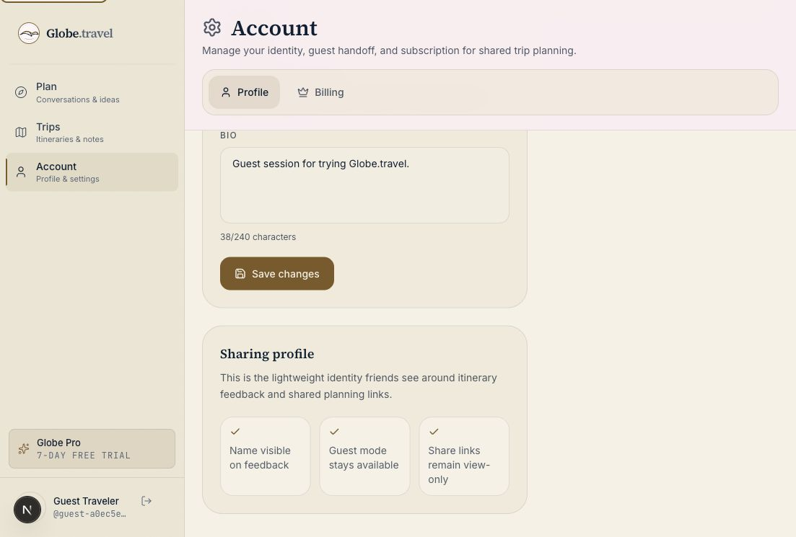

# Account Profile Identity Validation QA - 2026-05-18

## Scope

- Surface: `/account`
- User lens: returning guest managing the identity friends see on shared planning surfaces
- Viewport evidence: Browser on `http://localhost:3000/account`
- Risk class: P1 account trust and recovery polish

## Finding

The profile API accepted arbitrary profile update shapes and invalid or overlong public identity fields. The account form also lacked visible field limits and did not sync its editable fields after the async profile load, which could leave a returning guest looking at a populated account header but empty editable fields.

## Fix

- Added schema validation to `PATCH /api/profile`.
- Trimmed and normalized text profile fields before saving.
- Limited display name to 80 characters, username to 30 characters, bio to 240 characters, and travel style to 80 characters.
- Allowed guest-compatible usernames with lowercase letters, numbers, hyphens, and underscores.
- Returned clear `400` validation errors for invalid account identity updates.
- Synced account form state when the profile finishes loading or refreshes after save.
- Added visible display-name and bio counters, username helper copy, and an accessible error alert.

## Browser Evidence

- Route: `http://localhost:3000/account`
- Guest profile loaded into the editable fields after refresh.
- Invalid username `bad username!` produced: `Use 3-30 lowercase letters, numbers, hyphens, or underscores for username.`
- Valid guest profile save produced `Saved` with display name `QA Browser Traveler` and username `qa-browser-traveler`.
- No horizontal overflow or runtime error was detected during invalid or valid save checks.

## Automated Evidence

- `npm run qa:saved-account`: passed `13/13`
- New regression: `account profile API rejects invalid sharing identity updates`

## Remaining Risk

None for this slice. Broader account/billing responsive QA remains part of the Month 5 paid product readiness workstream.
