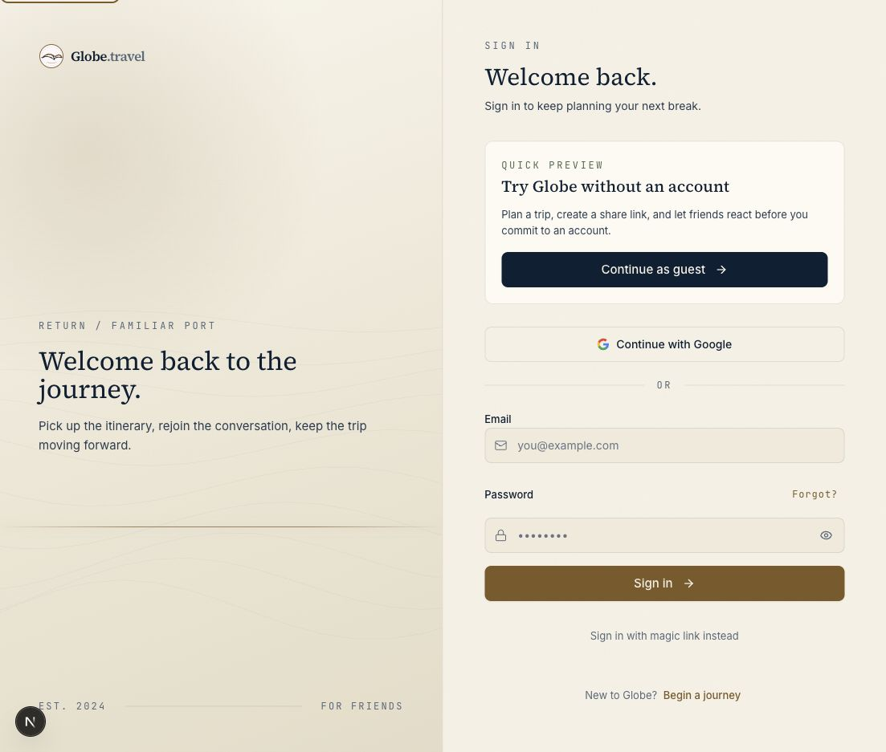

# Auth Guest Next Handoff QA - 2026-05-18

## Scope

- Surface: protected-route redirects, `/login`, `/signup`, `/api/guest/start`
- User lens: first-time user or logged-out returning user choosing guest mode after starting from a specific planner/protected URL
- Risk class: P1 activation and work-preservation trust

## Finding

Protected-route intent could be lost at the auth boundary. A user arriving at login with a planner prompt, such as:

```text
/login?q=Plan five days in Athens for friends with food and beaches
```

saw `Continue as guest`, but the guest action linked to plain `/api/guest/start`. The app could open an empty planner instead of preserving the trip idea or original protected destination. The same risk existed for login/signup handoffs because auth actions always returned to `/chat`.

## Fix

- Added safe local `next` helpers for auth redirects.
- Protected-route redirects now send users to `/login?next=<original-path-and-query>`.
- Login/signup guest links preserve the safe `next` destination.
- Login/signup interlinks preserve the safe `next` destination.
- Login/signup derive `next` from the hydrated route search string so pre-rendered fallback links update reliably for real users.
- Password login, direct signup session, magic links, and OAuth redirects now carry the safe destination forward.
- `/api/guest/start` now honors safe local `next` values and still supports legacy `q` prompt handoffs.
- Unsafe external, auth, or API `next` destinations fall back to `/chat`.

## Browser Evidence

In-app Browser verified:

- Route: `http://localhost:3000/login?next=/chat?q=Plan%20five%20days%20in%20Athens...`
- `Continue as guest` href preserved the encoded planner `next`.
- `Begin a journey` href preserved the encoded planner `next`.
- No horizontal overflow or runtime error appeared on the login page.
- Fresh retest after the hydration-aware link fix produced:
  - guest href: `/api/guest/start?next=%2Fchat%3Fq%3DPlan%2520five%2520days%2520in%2520Athens%2520for%2520friends%2520with%2520food%2520and%2520beaches`
  - signup href: `/signup?next=%2Fchat%3Fq%3DPlan%2520five%2520days%2520in%2520Athens%2520for%2520friends%2520with%2520food%2520and%2520beaches`



## Automated Evidence

- `npm run qa:auth-access`: passed `14/14`.
- `npm run lint`: passed.
- `npm run build`: passed.
- `git diff --check`: passed.

The upgraded auth gate verifies:

- auth source preserves protected `next` destinations.
- login guest and signup actions include the protected planner `next`.
- guest start preserves the planner prompt and can complete into Trip Studio.
- guest still opens saved/account surfaces and can read the owned trips API.
- disposable guest cleanup succeeds.

## Remaining Risk

This closes the guest/auth destination handoff path for local Browser QA. Production release gates still intentionally avoid mutating remote guest state unless `QA_ALLOW_REMOTE_GUEST_MUTATION=1` is set.
