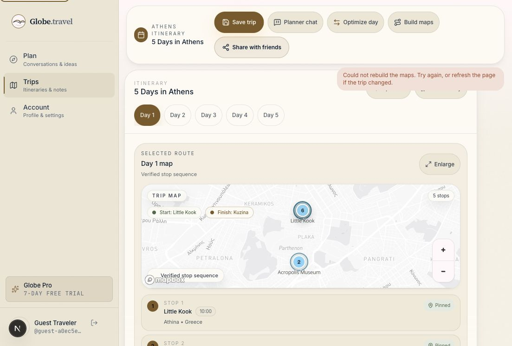

# Planner Word-Duration Handoff QA - 2026-05-18

## Scope

- Surface: `/chat?q=...` to `/trips/[tripId]`
- User lens: first-time guest describing trip length in ordinary language
- Risk class: P1 planner trust and map-trust setup

## Finding

Browser reproduced a natural-language parser bug with the prompt:

```text
Plan five days in Athens for friends with food, beaches, and relaxed mornings
```

Before the fix, Trip Studio opened with `4 Days in five days in Athens` and group-share copy said `Share this five days in Athens plan...`. The app also created four day rows instead of the requested five. This made the first generated trip feel untrustworthy before any itinerary items or maps were built.

## Fix

- Added shared day-count extraction for digit and word durations from one to fourteen days.
- Reused that parser in the chat draft handoff instead of the numeric-only local parser.
- Hardened destination extraction for prompts like `five days in Athens`, `two-day Lisbon itinerary`, and `Make me a four day Mexico City food trip`.
- Guarded against generic starter copy such as `beautiful 3-day city trip` being misread as a destination.
- Added prompt-suite fixtures for word-duration planning prompts.
- Upgraded `npm run qa:planner-handoff` so its Browser-style delayed query now verifies the word-duration path creates `5 Days in Athens`, five day rows, `destination_query: Athens`, and `constraints.days: 5`.

## Browser Evidence

Manual Browser before/after:

- Before: `4 Days in five days in Athens`; four day tabs; wrong share copy.
- After: `5 Days in Athens`; Day 1 through Day 5 visible; share copy says `Share this Athens plan...`.
- After state had no horizontal overflow and no app runtime error.
- Disposable Browser trips were deleted after verification.



## Automated Evidence

- `npm run qa:prompt-suite`: passed `56/56`.
- `npm run qa:planner-handoff`: passed `17/17`.

The upgraded planner handoff result specifically verified:

- `tripTitle: "5 Days in Athens"`
- `dayCount: 5`
- `destinationQuery: "Athens"`
- `constraintDays: 5`
- no overflow or app error on the phone viewport

## Remaining Risk

This closes the word-duration draft handoff path. Month 2 should still keep sampling real generated outputs for stochastic itinerary quality after the shell is created correctly.
